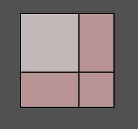
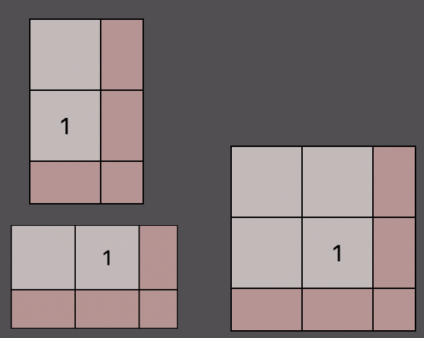
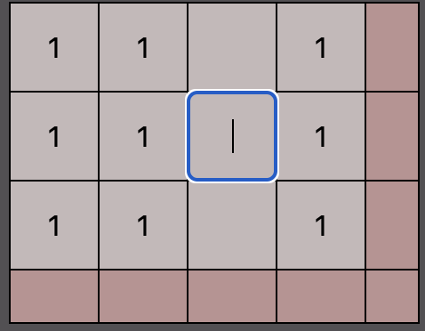
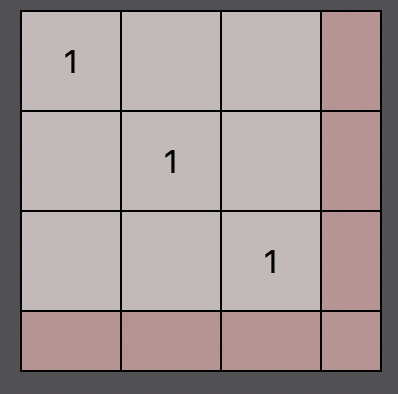
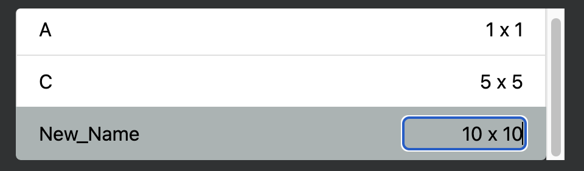

# Matrix Generator

The Matrix Generator is a web app that allows you to quickly enter matrices, then export them to text. You can also perform enter an expression to do basic matrix math 
(addition, subtraction, powers, and multiplication).

## The Matrix Editor

* You can edit the matrix using these boxes.
* The beige boxes are entries of the matrix, and typing in them will directly update the values in arrays. 
* The pink boxes are not entries in the matrix. Rather, typing in a pink box will expand the matrix by adding a row or column (or both). Thus, the matrix above is a 1x1 matrix. The matrices below are 2x1, 1x2, and 2x2.

* You can use the arrow keys or Tab to quickly navigate between the boxes.
* You can delete a row or column using Backspace on an empty row or column.

### Empty Boxes
* Empty boxes are not actually empty. They will be represented by a sparse value, which is set to 0 by default. For example, below is a 3x3 identity matrix. The empty boxes will be replaced by 0s when exporting or doing math. You can change the sparse value in the settings.

## Matrix Storage ##
* You can create an unlimited amount of matrices, and you can swap between them by clicking the buttons at the top of the page.
* All matrices must be given an unique name. The name can only contain uppercase/lowercase letters and underscores. Names will be generated when matrices are created based on previous ones (if A exists, the new matrix is named B, and so on).
* You can rename a matrix by clicking the name and entering a new one.
* The maximum matrix size is 50x50, and you can quickly resize a matrix by clicking the size, and entering a new size in the format n x m.

