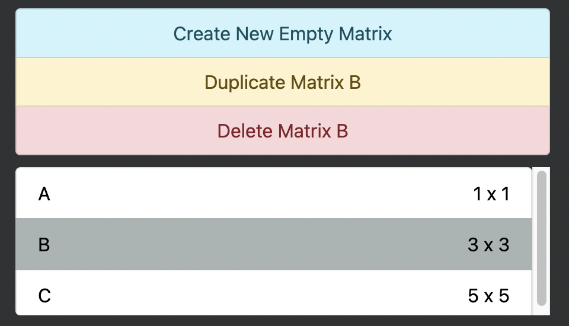
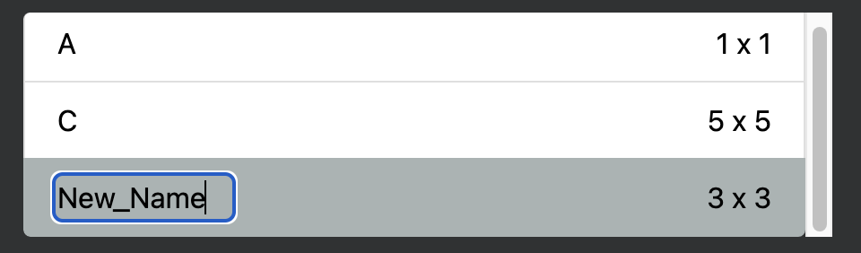
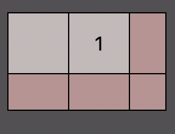
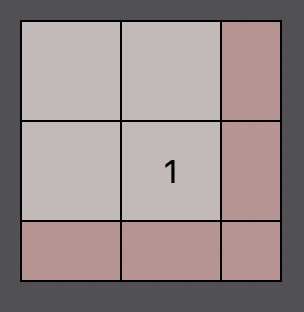
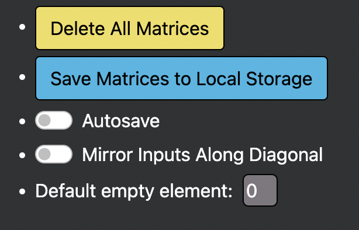
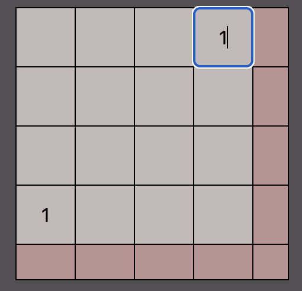

# Matrix Generator

The Matrix Generator is a web app that allows you to quickly enter matrices, then export them to text. You can also perform enter an expression to do basic matrix math (addition, subtraction, powers, and multiplication).

## Storage ##

* You can create an unlimited amount of matrices.
* Clicking "Create New Empty Matrix" creates a new 1 x 1 matrix.
* Clicking Duplicate Matrix will create a deep copy of the selected matrix. It is saved as a new matrix and [assigned a new name](#Names).
* Clicking Delete Matrix will delete it.

### Names
* All matrices must be given an unique name. The name can only contain uppercase/lowercase letters and underscores. 
* Creating or duplicating a matrix automatically assigns it a name. It will try to assign a name of "A", but if the name is already taken, it will assign it to the next uppercase letter that is available. If all 26 uppercase letters are taken, it will assign it to "AA", then if all 676 combinations of two uppercase letters are taken, then it goes to "AAA" and so on.

* You can rename a matrix by clicking the name and entering a new one.
* In the list, the matrices will be sorted by their name.

### Matrix Size
* The maximum matrix size is 50 x 50.
* You can quickly resize a matrix by clicking the size, and entering a new size n x m.

## Editing the Matrix
### Adding entries
* You can edit the matrix in the box below. This is a 1 x 1 matrix, where the beige box represents entry (1, 1) in the matrix, and the pink boxes are not entries in the matrix. Rather, typing in a pink box will expand the matrix.

* Type in a beige box to edit the corresponding entry on the matrix.
* Type in a pink box to expand the matrix. This also edits the corresponding entry on the expanded matrix.
    * Typing on a pink box above the diagonal adds one row to the right
    

    * Typing on a pink box to the left of the diagonal adds one column below
    

    * Typing on the pink diagonal box will add one row and one column.
    

    * You can press shift on a pink box to quickly add a row/column without editing the box.

## Deleting Rows or Columns

* If you want to delete a row or column, select any box in the row and column and press Backspace. The entire row/column must be empty. You can also resize the matrix as previously mentioned, which trims off the rightmost columns and bottommost rows.

## Empty Boxes
* Empty boxes are not actually empty. They will be represented by a sparse value, which is set to 0 by default. For example, below is a 3x3 identity matrix. The empty boxes will be replaced by 0s when exporting or doing math. You can change the sparse value in the settings.

## Settings

* Delete All Matrices will delete all the saved matrices. 
* Save Matrices to Local Storage will save all the matrices to your browser's local storage. Reloading the webpage will load your matrices back into the app.
* Autosave will save your matrices to your Local Storage anytime you:
    * Edit a matrix
    * Add a matrix
    * Delete a matrix (or delete all matrices)
    * Edit a setting (settings are also saved)

* Mirror Inputs Along Diagonal will toggle mirror mode. When you edit box (i, j), the corresponding box along the diagonal (j, i) will be set to the same value you entered. New empty rows/columns may be added if your matrix is not big enough.

 

