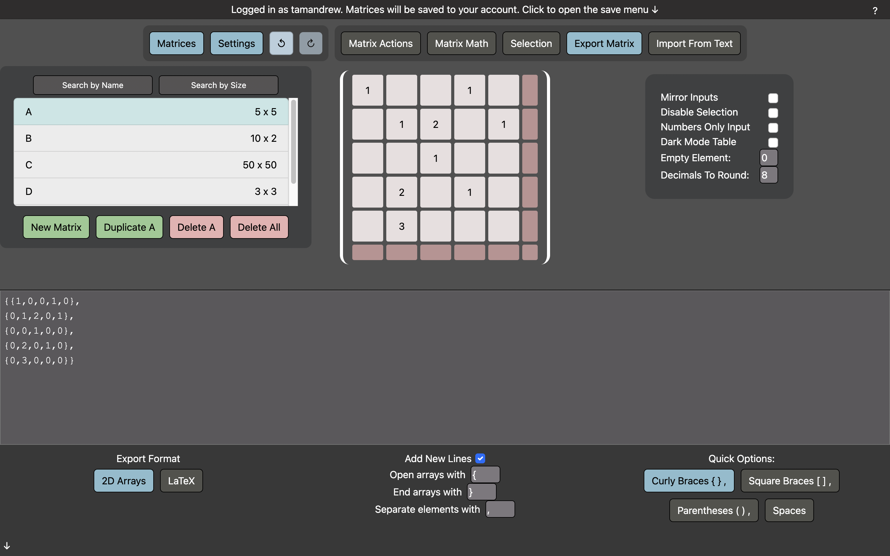

# Matrix Generator

## Description
The [Matrix Generator](https://matrixgen.web.app) is a full stack web app that allows you to quickly enter matrices, then export them to text. There are additional features such as matrix math and quick actions. You can save your data to your browser's local storage, or create an account to save to the cloud. 

You can view a recorded demo of the app [here](https://andrewtam.org/MatrixGenerator).



## Technologies
- [TypeScript](https://www.typescriptlang.org/download)
- [Docker](https://www.docker.com/products/docker-desktop)
- [PostgreSQL](https://www.postgresql.org/download/)
- [FastAPI](https://fastapi.tiangolo.com/tutorial/first-steps/)
- [React](https://reactjs.org/docs/getting-started.html)
- [Next.js](https://nextjs.org/docs/getting-started)
- [Bootstrap](https://getbootstrap.com/)

## Installation
Clone this repository, and update the environmental variables in backend/.env.template (rename this to .env) and in frontend/.env.local.template (rename this to .env.local). This app is built using docker, run ```docker compose up``` at the root of the project.

```
git clone https://github.com/tamandrew/matrix-gen.git
docker compose up
```

To start the frontend local server:
```
npm run dev
```

To start the backend local server:
```
python3 -m uvicorn app.main:app --reload --port 8080 --host 0.0.0.0
``` 
